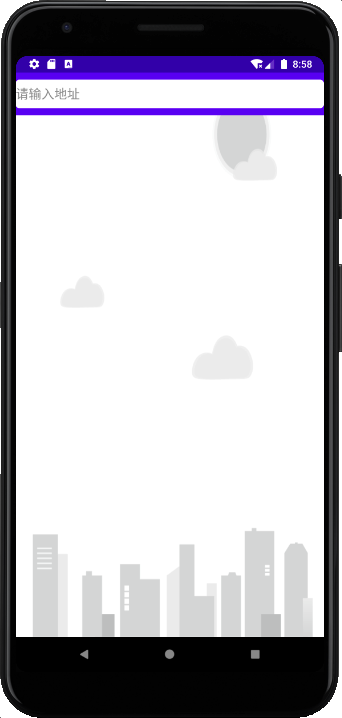
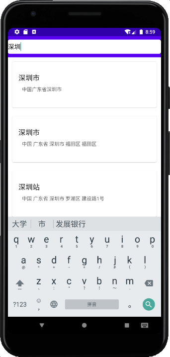
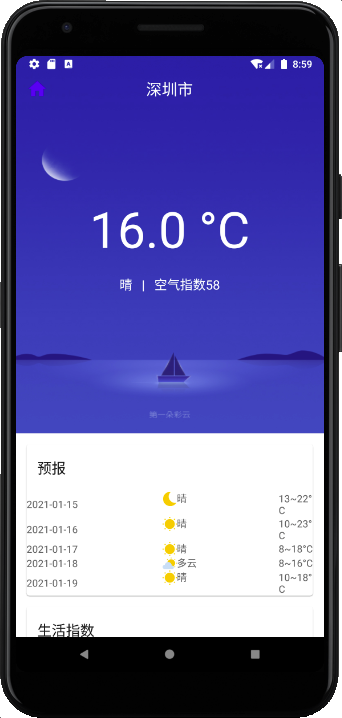
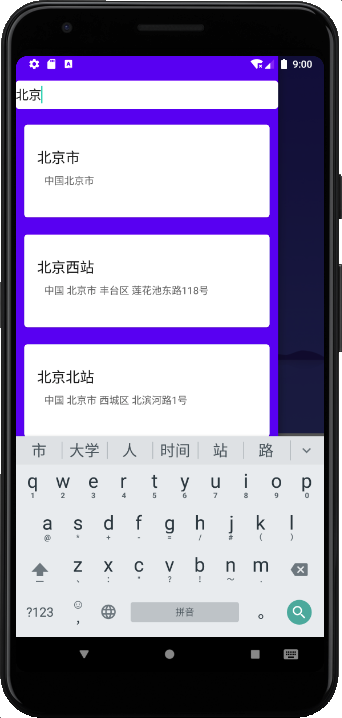
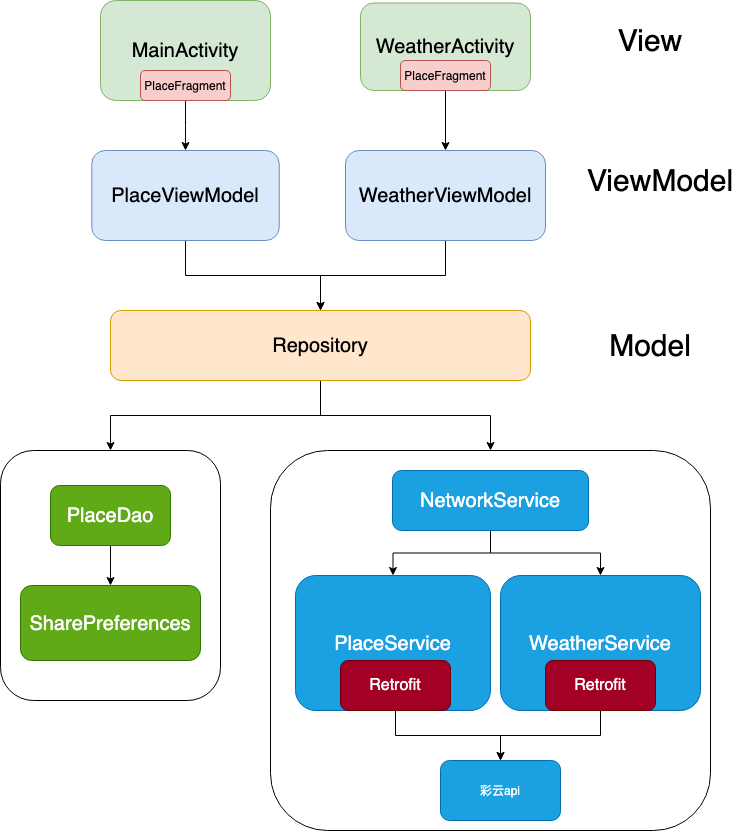

## HannyWeather

这是一个用Kotlin编写的Android天气App。使用的技术主要有:

- Jetpack组件: ViewModel,LiveData,ViewBinding等等
- 网络组件: Retrofit
- 并发组件: Kotlin协程
- 数据持久化: SharePreferences
- UI: Material Design
- API: 彩云天气

### 界面

### 技术架构

### 不足之处

1. Material Design不够规范，页面还不够好看
2. 目前只保存了一个城市，没有实现同时观察多个城市
3. 没有对深色主题进行适配
4. 没有充分利用api的信息
5. 无法同步已保存的城市（地点）

### 展望

- [ ] 规范化Material Design，美化页面
- [ ] 将RelativeLayout替换成ConstraintLayout，优化布局
- [ ] 实现多城市同时保存
- [ ] 适配深色主题
- [ ] 添加可选登陆同步功能
- [ ] 利用api的其他信息
- [ ] 将api和model之间搭建适配器(adapter)，可以同时接入不同的api
- [ ] 利用爬虫技术自己写api